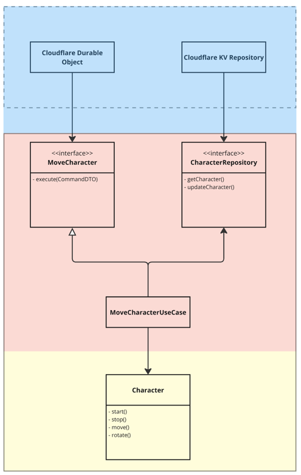

# Animation service

## Overview

The demo animation service simulates a session where animated characters (e.g., Circle, Triangle)
perform actions based on commands received via a WebSocket. The character’s state is persisted using
Cloudflare’s KV storage. The application validates business rules on state transitions.

### Architecture

Animation service separated to several layers (see diagram):

- Controllers - handling endpoints
- Infrastructure - data transfer
- Application - entities orchestration and application logic
- Domain - core business logic



This approach make possible to switch between cloud providers by implementing
another endpoint controller and ICharacterRepository interface:

```typescript
interface ICharacterRepository {
	getCharacter(characterId: string): Promise<Character | undefined>;

	updateCharacter(character: Character): Promise<void>;
}
```

#### Applied principles and technics

- SOLID:
	- Each module in service has one responsibility
	- Changes in DO will not affect repository,
	  changes repository will not affect use case,etc.
	- We use DI to not depend on infrastructure
	- We can change implementation using substitution principle
- Clean Architecture
- Command and Factory patterns - for better scalability in future

### Sessions

As session initialization isn't described in Task description I decided to hardcode a few
sessions:

```javascript
const validSessions = ['session1', 'session2', 'session3'];
```

## Getting Started

### Prerequisites

- Node.js
- Wrangler CLI: For local development and deployment to Cloudflare Workers.
- A Cloudflare account with access to Workers and KV Namespaces

### Installation

1. Clone repo and install dependencies:

```
git clone  https://github.com/valeriivolkovskyi/animation-demo.git
cd animation
npm install
```

2. Configure Your Environment:

- Run `npx wrangler login` to authorize you Cloudflare account.
- create `.env` file and add your `ANIMATION_KV_ID` to access to you KV storage.

3. Run the application locally using wrangler:

```
npx wrangler dev
```

## API Endpoints

### REST Endpoints

Following task requirements REST API endpoints is protected with authorization.
For demo purposes here is hardcoded credentials:
login: `admin`
password: `admin`.

GET `/{sessionId}/state` - list all characters with their current state
GET `/{sessionId}/characters` - list all active characters
GET `/{sessionId}/logs` - logs

Try tp ppen link in your browser`http://localhost:8787/session1/state`

## WebSocket Endpoint

### Usage:

1. Establish a WebSocket Connection:
   Use a WebSocket client to connect to `ws://localhost:8787/{sessionId}/ws`.

2. Send Commands:
   Send JSON messages in the following format to execute character commands:

```json
{
	"characterId": "1",
	"command": "start"
}
```

3. Receive Updates:
   The server broadcasts updates to all connected clients whenever a command is successfully executed.

## Deployment

Deploy the demo app to Cloudflare Workers:

```bash
npx wrangler publish
```
